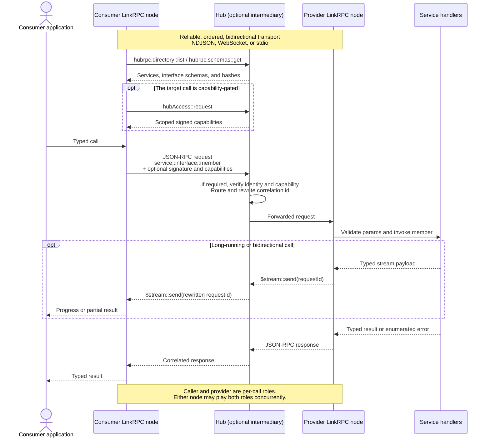

# @hediet/linkrpc

Typed, multiplexed RPC over a single bidirectional connection.

linkrpc is a **specialization of [JSON-RPC 2.0](https://www.jsonrpc.org/specification)**: every
message on the wire is a valid JSON-RPC message, and linkrpc adds just enough on top to let many
strongly-typed services share one connection — an addressing grammar, built-in reflection,
content-addressed interface identity, and optional layers for signing and capabilities.

## How linkrpc works



The **nodes** are the protocol participants: each is one endpoint of one bidirectional connection.
The **hub** is optional; on a direct connection the consumer node talks to the provider node without
the routing and access-broker steps. A **service** is a concrete provider of one or more typed
interfaces. Reflection exposes those interfaces at the connection boundary, while signatures identify
the caller and capabilities authorize specific calls. Optional metadata stays inside reserved
`$hubrpc`-prefixed `params` members, so peers that only implement the Core profile can still handle
ungated calls.

You describe an interface once with [zod](https://zod.dev) schemas. The same definition gives you a
fully-typed client *and* type-checked server handlers, and validates params and results at runtime.

```ts
// shared.ts
import { defineInterface, requestType, notificationType } from '@hediet/linkrpc';
import { z } from 'zod';

export const greeter = defineInterface(
    { id: 'test.greeter', description: 'Greets people.' },
    {
        hello: requestType(
            z.object({ name: z.string() }),
            z.object({ greeting: z.string() }),
        ),
        shout: notificationType(z.object({ msg: z.string() })),
    },
);
```

Put the interface in `shared.ts`, then serve it over a WebSocket:

```ts
// server.ts
import { LinkRpcConnection } from '@hediet/linkrpc';
import { WebSocketServer } from '@hediet/linkrpc-hub/hub/server/node';
import { greeter } from './shared.js';

const token = process.env.LINKRPC_TOKEN;
if (!token) throw new Error('LINKRPC_TOKEN is required');

const listener = await WebSocketServer.start({
    host: '127.0.0.1',
    port: 7878,
    isTokenAccepted: async candidate => candidate === token,
});

listener.setConnectionHandler(transport => {
    const connection = LinkRpcConnection.fromTransport(transport);
    connection.register(greeter, {
        hello: async ({ name }) => ({ greeting: `Hi, ${name}!` }),
        shout: ({ msg }) => console.log('heard:', msg),
    });
});
```

Connect from another process — the generated proxy remains fully typed:

```ts
// client.ts
import { LinkRpcConnection } from '@hediet/linkrpc';
import {
    openWebSocket,
    runInitializeHandshake,
    WebSocketTransport,
} from '@hediet/linkrpc/node';
import { greeter } from './shared.js';

const token = process.env.LINKRPC_TOKEN;
if (!token) throw new Error('LINKRPC_TOKEN is required');

const socket = await openWebSocket('ws://127.0.0.1:7878');
const transport = new WebSocketTransport(socket);
await runInitializeHandshake(transport, {
    kind: 'client',
    token,
});

const client = LinkRpcConnection.fromTransport(transport);
const g = client.get(greeter);                          // typed proxy
await g.hello({ name: 'world' });                       // → { greeting: 'Hi, world!' }
g.shout({ msg: 'boom' });                               // fire-and-forget notification
```

Pass the wrong shape and TypeScript stops you at compile time; if a bad value reaches the wire
anyway, the provider rejects it with a JSON-RPC `-32602 invalidParams`.

## Static contracts and reusable bindings

`StaticHubSchemaDocument`, `InterfaceRef`, and `parseStaticHubSchema` are library
APIs, independent of the CLI. A document contains `interfaceSchemas` and optional
`services`, `defaultInterface`, and `bareInterfaces`:

```ts
const ref = { interfaceId: greeter.info.id, interfaceHash: greeter.schemaHash };
const contract = parseStaticHubSchema({
    interfaceSchemas: [greeter.toSchema()],
    services: [{ serviceId: '', interfaces: [ref] }],
    defaultInterface: ref,
    bareInterfaces: [{ interface: ref, prefix: 'Runtime.' }],
});
```

Every reference must resolve to an exact id/hash pair, and every declared schema
hash is verified. Duplicate services, interfaces within a service, and bare
prefixes are rejected. Overlapping prefixes retain longest-prefix routing;
an empty bare prefix may coexist with `defaultInterface` only for the same ref.
The default and a root-qualified interface with the same id must also use the
same hash; different versions under named services remain independent.
Schema-only and bare-only documents do not need `services`.

The same interface definition can be used with immutable typed descriptors:

```ts
import { interfaceTarget, defaultInterfaceTarget, bareInterfaceTarget } from '@hediet/linkrpc';

const root = interfaceTarget(greeter);                         // test.greeter::hello
const service = interfaceTarget(greeter, { serviceId: 'app' }); // app::test.greeter::hello
const preset = defaultInterfaceTarget(greeter);               // hello, LinkRPC metadata
const foreign = bareInterfaceTarget(greeter, { prefix: 'Runtime.' }); // Runtime.hello, no metadata

await connection.get(service).hello({ name: 'world' });
connection.register(service, { hello: ({ name }) => ({ greeting: name }), shout: () => {} });
```

`get` and `register` accept all descriptors. Existing definition-based overloads,
`service()`, `getBare()`, and `bareInterfaceTarget()` remain supported. Default
targets retain interface-hash metadata and streaming; bare targets deliberately
omit metadata and reject streaming clients. Registering a default or bare target
also installs its qualified interface registration, exactly as existing bare
registration does. Do not register its root alias a second time. Duplicate
registrations and occupied prefixes still fail atomically; disposal removes the
registration and its binding.

`generateTsContract(contract, options)` produces a single TypeScript module with
one definition per schema and separate bindings (no duplicated interface types).
It composes `generateTsInterface` and preserves canonical wire schemas. Options
include `linkRpcImport`, `interfaceNames` keyed by `id@hash`, and `bindingNames`
keyed by `root:id@hash`, `service:serviceId:id@hash`, `default`, or `bare:prefix`.
Derived export names are deterministic; ambiguous names require explicit
overrides rather than order-dependent suffixes. Unknown overrides are errors.

`exportStaticHubSchema(channel, { serviceId?, maxDepth?, timeoutMs? })` reflects
directory interfaces, `defaults.get`, and `defaults.listBindings`, retrieves and
verifies schemas, and returns this same document. Missing reflection, inaccessible
or depth-limited directories, truncation, incomplete defaults, and schema failures
are errors, not partial successful contracts. `serviceId` selects the reflection
scope; default/bare descriptors describe the preset routes reported by that
scope and must be used against the corresponding endpoint. Diagnostic directory
graphs are not part of the static contract.

## Inspecting independently owned connections

`InspectionHost` exposes one topology and traffic view through any number of
LinkRPC connections. It does not route application messages and does not require
a Hub. Tracking a connection and exposing inspection are separate operations:

```ts
import { InspectionHost } from '@hediet/linkrpc/inspection';

const inspection = new InspectionHost({ nodeId: 'main', label: 'Main process' });

// cdpClient is a LinkRpcConnection over a CDP adapter.
const tracked = inspection.trackConnection(cdpClient, {
    portId: 'cdp-1',
    label: 'Chrome connection',
    peer: { nodeId: 'chrome', portId: 'debugger' },
    transport: { type: 'websocket' },
});

// Repeat for each frontend connection; they share the same inspection host.
const binding = inspection.expose(frontendConnection, {
    serviceId: 'main.inspection',
});
frontendConnection.enableReflection();
```

The remote frontend uses the standard inspection interfaces:

```ts
import { topologyInterface, trafficInterface } from '@hediet/linkrpc/inspection';

const service = frontendClient.service('main.inspection');
const graph = await service.get(topologyInterface).getGraph({});
const watch = service.get(trafficInterface).watch({}, {
    onMessage: event => console.log(event),
});

// Later:
await watch.cancel();
await watch;
```

- Tracked connections share the host's node identity and have distinct port IDs.
  Peer identity is optional; without it, the graph includes the local port but
  does not invent a remote node or probe a foreign protocol.
- `watchGraph` emits invalidation ticks; re-fetch `getGraph` after each tick.
  Adding/removing sources and bindings, closing tracked connections, and source
  topology changes invalidate the graph.
- `watch` omits payloads. `watchWithPayloads` explicitly requests capped payloads.
  Use the connection's normal authentication/authorization policy to restrict
  inspection access; topology IDs are not security identities.
- Each subscriber has independent filtering and a bounded queue with overflow
  reporting. Watch-control flows remain tracked even without subscribers, so
  inspection streams never recursively observe themselves. Ordinary frontend
  traffic is not included unless that connection is explicitly tracked.
- `binding.dispose()` unregisters that exposure and ends its watches.
  `tracked.dispose()` removes that connection from inspection.
  `inspection.dispose()` removes all exposures and observations.
  None of these closes application connections. `LinkRpcConnection.close()`
  automatically removes its bindings and tracked ports; adapters must still
  propagate transport shutdown to the connection's lifecycle.
- CDP traffic is observed above the adapter: events contain normalized JSON-RPC
  messages and logical request IDs, not exact CDP WebSocket frames.

For custom producers, `addSource` accepts an `InspectionSource` supplying topology
snapshots, topology invalidations, and normalized traffic. The Hub uses this same
host through a routing-source adapter. `connection.enableInspection()` remains
the convenience API for inspecting just that endpoint, using the same shared
RPC implementation.

## Typed application errors

Declared application errors are returned as values by the default client. Declare stable
names (and optional payload schemas), then attach them to a request:

```ts
import { applicationError, isRpcFailure } from '@hediet/linkrpc';

const notFound = applicationError('NotFound', { message: 'Not found' });
const conflict = applicationError('Conflict', {
    message: 'Conflict', data: z.object({ currentVersion: z.number() }),
});

const documents = defineInterface({ id: 'acme.documents' }, {
    read: requestType(z.object({ id: z.string() }), z.string())
        .withErrors([notFound, conflict] as const),
});

connection.register(documents, {
    read: ({ id }) => id === 'missing' ? notFound.create() : load(id),
});
```

Calls are real promises of `Result<T, E>`, an alias for `T | RpcFailure<E>`. The branded
library wrapper cannot collide with an ordinary successful object. Generic RPC errors
(undeclared codes, noncompliant peer errors, local validation failures, transport failures) still throw:

```ts
const client = connection.get(documents);
const outcome = await client.read({ id });
if (isRpcFailure(outcome)) {
    if (conflict.is(outcome.error)) {
        console.log(outcome.error.data.currentVersion); // statically typed
    } else {
        console.log(outcome.error.type); // 'NotFound'
    }
} else {
    console.log(outcome); // string
}
```

Use `connection.getResultClient(documents)` (also available on service handles) to return
**all request failures** as values, even for methods without declared errors:

```ts
const safe = connection.getResultClient(documents);
const result = await safe.read({ id });
if (isRpcFailure(result)) {
    const failure = result.error;
    if (failure.kind === 'application') {
        console.log(failure.error.type); // 'NotFound' | 'Conflict'
    } else if (failure.error.kind === 'remote') {
        console.error(failure.error.code, failure.error.message);
    } else if (failure.error.kind === 'nonCompliantServer') {
        console.error(failure.error.original, failure.error.issues);
    } else {
        console.error(failure.error.cause); // local or explicitly identified transport failure
    }
}
```

The safe client also captures synchronous request-initiation errors. Streaming terminal
responses follow the same policy and retain `send`, `cancel`, `dispose`, and `ping`.
Notification and stream-control failures do not become terminal result values.
The deprecated `.result()` compatibility method retains its `{ ok, value/error }` shape.
Metadata-free targets also work: `connection.getResultClient(bareInterfaceTarget(documents))`.
Like `get`, this target form does not accept LinkRPC routing options or streaming methods.
Descriptor `.is` matchers require a branded application value or `RpcFailure` wrapper;
decoded application payloads carry an internal brand, so successful lookalike objects
never match.

Named errors use JSON-RPC `{ code: 1, message, data: { type: 'NotFound' } }` by default;
payload errors put their data in `error.data.data`. `ErrorCode.applicationError` exports
the default code `1`. The optional `code` overrides this default,
and an omitted diagnostic message defaults to the name. Recognition checks the declared
**type, code and payload**, not the message. Names must be unique within a method, but
different names may share a code. Names must be nonempty. Unit errors omit the inner `data`; payload errors require
valid JSON data (including `null` only when their schema allows it).

Legacy `applicationError(404, 'Not found', optionalDataSchema)` and schemas without `type`
retain their old untagged wire format and literal message constraint. Legacy numeric
codes must be unique independently of named errors; named and legacy errors may share
a code, with named recognition attempted first. All codes must fit a signed 32-bit integer and avoid `-32768..-32000`
and LinkRPC's `-32800` cancellation code. The legacy third `requestType` error-schema
argument remains accepted, but does not declare checked errors. Generic origin is based
on explicit channel metadata, never inferred from a numeric code. Unclassified exceptions
are local; senders can identify transport errors with `RpcError`'s `transport` origin.
The numeric code decides handledness first. All declarations sharing that code form
an explicit schema union. Named branches are tried before legacy branches, and any
valid branch returns a declared error. Thus, a permissive legacy payload may accept an
envelope that fails a named branch: this is an inherently ambiguous legacy contract.
If no branch validates, the normal client throws `NonCompliantServerError`, not the
original `RpcError`. Its `kind` is `nonCompliantServer`, `original` retains the wire
`{ code, message, data? }` including data presence, and `issues` contains
`{ path, message }` diagnostics. Paths are JSON Pointers relative to the original
error, for example `/data/type` or `/data/data/resource`. Safe clients return this
error instance under the `generic` case. An undeclared code remains a `remote` error.

Each candidate is parsed once by its declared decoder, and the client uses that
parsed result directly. Defaults, coercions, and unknown-field handling follow
that decoder; there is no separate, stricter JSON Schema validation pass.
Exported `ErrorSchema` includes `type` for named errors, a required
resolved numeric `code`, and a `data` schema describing the inner payload.

### Raw JSON-RPC error bodies

Use `rpcError` for foreign protocols or errors without LinkRPC's named envelope:

```ts
import { rpcError } from '@hediet/linkrpc';

const retry = rpcError(-32001, {
    message: z.string(),
    data: z.object({ retryAfter: z.number() }),
});
const opaque = rpcError(-32002, { data: z.unknown().optional() });
const detail = rpcError(-32003, { data: z.union([z.string(), z.number()]) });

const requests = defineInterface({ id: 'acme.foreign' }, {
    read: requestType(z.object({}), z.string()).withErrors([retry, opaque, detail]),
});

connection.register(requests, {
    read: () => retry.create({ message: 'Retry in 3 seconds', data: { retryAfter: 3 } }),
});
const value = await connection.get(requests).read({});
if (isRpcFailure(value) && value.error.code === -32001) {
    console.log(value.error.data.retryAfter); // number, narrowed by code
}
```

The message schema defaults to `z.string()`; the wire message is diagnostic, not a
discriminator, unless the schema explicitly uses a literal. The body-schema overload,
`rpcError(code, z.union([...bodySchemas]))`, supports imported body unions as well.
`.create({ message, data? })` and `.is(...)` produce and match nominal handled errors,
without inserting a wire `type` field. Missing and null data follow the declared
decoder's semantics. Present `undefined` and other non-JSON values are rejected
before serialization.

Raw codes can use the JSON-RPC reserved range (including `-32001`), but must be signed
32-bit integers. A raw declaration must have a unique code and cannot share it with
named or legacy declarations. The named `applicationError` guard and default code `1`
are unchanged.

The canonical schema representation is exactly `{ code, schema }`, where `schema`
describes the wire body `{ message: string, data?: JsonValue }`, **excluding code**.
Raw declarations have no sibling `type`, `message`, or `data` properties. Their body
schemas are normalized and hashed like other schema positions. Existing named and
legacy schema representations are unchanged. Import/export and generated contracts
preserve the raw representation and its typed descriptor tuple.

Interface JSON includes these declarations and their referenced data schemas in the hash.
CLI-generated definitions expose the same typed constructors through
`definition.members.method.errors[index].create(...)`. See the
[Rust/TypeScript interoperability proof](../../../interop/README.md) for both authoring directions.

## Reflection — discoverability built in

A connection is self-describing. Call `enableReflection()` and it exposes three standard interfaces
backed by its live registry, so a peer (or the [`linkrpc` CLI](../linkrpc-cli)) can explore and call
it with **no prior knowledge** — list the services, fetch their schemas, generate a typed client at
runtime:

- **`hubrpc.directory`** — which services and interfaces this connection serves (each with its `id@hash`).
- **`hubrpc.schemas`** — the full schema for any advertised interface.
- **`hubrpc.defaults`** — the connection's empty-prefix bare interface registration, if any.

```ts
connection.register(bareInterfaceTarget(greeter), handlers);
// The interface remains available as `test.greeter::hello` and also as bare `hello`.
connection.service('acme').register(
    bareInterfaceTarget(documents, { prefix: 'documents/' }),
    documentHandlers,
);
connection.enableReflection();      // directory / schemas / defaults, for free
```

Because the served contract is observable from the boundary, generic tooling — explorers, the CLI,
conformance checkers — works against any endpoint without compiled-in knowledge of its interfaces.

## Streaming

Any request can carry in-flight, bidirectionally-correlated stream messages — input from the caller
*and* progress or partial results from the provider, on the same call. Declare a payload schema per
direction with `.withStream({ client, server })`:

```ts
const transcribe = defineInterface({ id: 'acme.voice' }, {
    // client streams audio chunks; server streams partial transcripts; returns the final text.
    session: requestType(z.object({ lang: z.string() }), z.object({ text: z.string() }))
        .withStream({
            client: z.object({ audio: z.string() }),     // client → server
            server: z.object({ partial: z.string() }),   // server → client
        }),
});

// provider: consume client messages, emit server messages, return the final result.
server.register(transcribe, {
    session: async ({ lang }, _ctx, stream) => {
        let text = '';
        stream.onMessage(({ audio }) => {                // client → server
            text += decode(audio, lang);
            stream.send({ partial: text });              // server → client
        });
        await untilSilence();
        return { text };
    },
});

// caller: send input as it arrives, observe partials, await the final result.
const call = client.get(transcribe).session(
    { lang: 'en' },
    { onMessage: ({ partial }) => console.log('…', partial) },   // server → client
);
await call.send({ audio: chunk1 });                              // client → server
await call.send({ audio: chunk2 });
const { text } = await call;                                     // final result
```

Declare only `server` for provider→caller progress, only `client` for caller→provider input, or
both for a full duplex session. Cancellation (`call.cancel()`), keepalive pings, and idle-timeout
handling are wired in for you; a handler observes cancellation via an `AbortSignal`.

## Identity & capabilities

On an untrusted link — a shared hub, a sandboxed extension — you often need to know *who* is calling
and *what they're allowed to do*. linkrpc layers both on top of the same JSON-RPC envelope, and both
are optional: a plain call needs neither.

**Signing (identity).** A call can be Ed25519-signed by a **principal**. The signature covers the
method, params, a freshness timestamp, and a one-time nonce, so a provider can authenticate the
caller and reject replays or tampered forwards. Principals are managed for you
(`createManagedPrincipal`, `loadOrCreateIdentity`); on Node, `connectToHub({ principal })` signs
outgoing calls transparently.

**Capabilities (authorization).** A **capability** is a signed grant from an issuer to an audience
listing exactly which calls are permitted — optionally narrowed to specific services, interfaces,
param values, or even one exact call. Capabilities delegate by chaining (each link can only narrow
the authority it received), and a provider runs the **gate** — verify identity → resolve the chain →
check permission — admitting the call only if some presented capability permits it. It's
fail-closed: with no permitting capability, a gated call is refused with `-32401 permissionRequired`.

Here is a complete capability-gated notes service. First create the identities and issue authority:

```ts
import {
    defineInterface,
    invoke,
    issueCapability,
    KeypairSigningIdentity,
    prefix,
    requestType,
    TransportPair,
} from '@hediet/linkrpc';
import { object, string } from 'zod/mini';

const notes = defineInterface({ id: 'demo.notes' }, {
    read: requestType(
        object({ id: string() }),
        object({ contents: string() }),
    ),
});

const adminId = await KeypairSigningIdentity.generateNew();
const appId = await KeypairSigningIdentity.generateNew();
const capability = await issueCapability(adminId, {
    audience: appId.publicSigningIdentity,
    permissions: [
        invoke('notes', notes, 'read', {
            id: prefix('public/'),
        }),
    ],
});

// Capabilities are portable JSON, not callbacks or shared process state.
const capabilityJson = JSON.stringify(capability);
const transport = new TransportPair();
const notesById = new Map([
    ['public/roadmap', 'Ship it!'],
    ['private/payroll', 'Classified'],
]);
```

The server gates its incoming transport, so rejected calls never reach its handlers:

```ts
import { LinkRpcConnection } from '@hediet/linkrpc';
import { withFullyQualifiedCallGate } from '@hediet/linkrpc-hub/hub/server';

const serverTransport = withFullyQualifiedCallGate(transport.b, {
    requireCapability: true,
    trustedRoots: [adminId.publicSigningIdentity],
});
const server = LinkRpcConnection.fromTransport(serverTransport);
let handlerCalls = 0;

server.register(notes, {
    read: ({ id }) => {
        handlerCalls++;
        return { contents: notesById.get(id) ?? 'Not found' };
    },
}, { serviceId: 'notes' });
```

The client parses the capability as ordinary JSON, then a signing channel attaches it to every call:

```ts
import {
    LinkRpcConnection,
    JsonRpcChannel,
    Principal,
    SigningSender,
    type SignedCapability,
} from '@hediet/linkrpc';

const receivedCapability: SignedCapability = JSON.parse(capabilityJson);
const appPrincipal = await Principal.create(appId, [receivedCapability]);
const signedChannel = SigningSender.wrapChannel(
    JsonRpcChannel.create(transport.a),
    { principal: appPrincipal },
);
const client = new LinkRpcConnection(signedChannel);
const notesClient = client.service('notes').get(notes);

await notesClient.read({ id: 'public/roadmap' });  // allowed
await notesClient.read({ id: 'private/payroll' })
    .catch(error => console.log(error.code));       // -32401 permissionRequired
handlerCalls;                                       // 1
```

The service-scoped client emits `notes::demo.notes::read`, so the gate checks it. Root-addressed calls
terminate at the connection root and always bypass this forwarded-call gate.

This is what lets a [hub](../linkrpc-hub) broker calls between mutually-distrusting participants: it
hands each consumer a scoped capability and enforces it on every routed call.

## A layered protocol

linkrpc is built in additive layers. Lower layers stand alone; higher ones ride in reserved
`$hubrpc`-prefixed members that a peer who doesn't implement them treats as opaque. That's what lets
a minimal node and a fully-secured node interoperate on any call that needs no gated authority.

| Layer | What it adds |
|---|---|
| Messages | JSON-RPC envelope, `::` method grammar, error codes |
| Transport | framed whole-message channel + endpoint URIs |
| Interfaces | schema format, JSON Schema subset, the interface hash |
| Reflection | `hubrpc.directory` / `.schemas` / `.defaults` |
| Streaming *(optional)* | in-flight correlated stream messages |
| Identity *(optional)* | Ed25519-signed calls (principals, freshness + replay protection) |
| Capabilities *(optional)* | signed grants + the authorization gate (`permits`) |

The full normative protocol — every layer, wire field, and conformance rule — is specified in
the [LinkRPC specification](../../../spec) (start at [`00-overview.md`](../../../spec/00-overview.md)). The
hub model and design notes live in [`docs/`](./docs).

## Interface identity & schema tooling

Every interface has an identity of the form `test.greeter@<hash>`, where the hash is derived from
the *normalized* schema of its members. Two peers agree on an interface only when their contracts
are structurally identical, so a mismatch surfaces up front as a hash disagreement rather than a
decode error three calls later. The hashing is defined byte-for-byte (RFC 8785 JCS → SHA-256,
truncated) so independent implementations in any language agree. Because the schema is just data,
you get tooling for free:

- **`computeInterfaceHash(schema)`** — the stable `@hash` for a schema.
- **`isAssignable(a, b)`** — structural compatibility: is every value of interface `A` accepted by `B`?
- **`generateTsInterface(schema)`** — emit a `.ts` client/server typing from a schema fetched at runtime.

## Transports & entry points

The core (`@hediet/linkrpc`) is environment-agnostic. Platform transports live behind subpath
exports so browser bundles never pull in Node built-ins:

| Import | Provides |
|---|---|
| `@hediet/linkrpc` | interfaces, connection, schema/hash, identity, capabilities |
| `@hediet/linkrpc/node` | NDJSON sockets, WebSocket, stdio, `connectToHub`, endpoint-URI parsing |
| `@hediet/linkrpc/web` | `WindowMessageTransport` (iframe / web worker) |
| `@hediet/linkrpc/hub/common`, `/hub/client` | hub-facing interfaces and client helpers |

On Node, a single call resolves an endpoint from the environment and dials it:

```ts
import { connectToHub } from '@hediet/linkrpc/node';
import { directoryInterface } from '@hediet/linkrpc';

// reads LINKRPC_ENDPOINT (unix:/npipe:/ws:/wss:/cmd:) and LINKRPC_TOKEN
const hub = await connectToHub();
const dir = hub.connection.get(directoryInterface);
console.log(await dir.list({}));
```

## Companion packages

| Package | Role |
|---|---|
| **`@hediet/linkrpc`** (this package) | the core library |
| [`@hediet/linkrpc-cli`](../linkrpc-cli) | generic CLI / terminal UI for any endpoint |
| [`@hediet/linkrpc-hub`](../linkrpc-hub) | standalone WebSocket hub that routes between participants |

## Development

```sh
pnpm --filter @hediet/linkrpc build
pnpm --filter @hediet/linkrpc test
```

`zod@^4` is a peer dependency.
