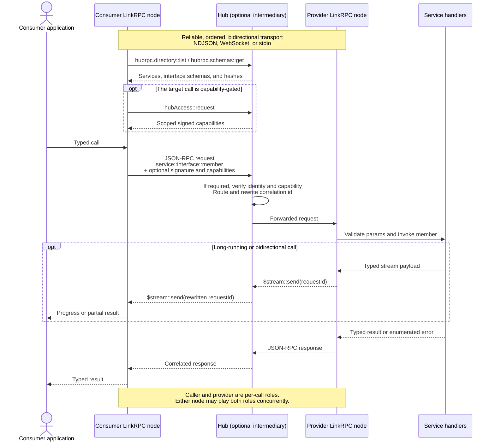

# @hediet/linkrpc

Typed, multiplexed RPC over a single bidirectional connection.

linkrpc is a **specialization of [JSON-RPC 2.0](https://www.jsonrpc.org/specification)**: every
message on the wire is a valid JSON-RPC message, and linkrpc adds just enough on top to let many
strongly-typed services share one connection — an addressing grammar, built-in reflection,
content-addressed interface identity, and optional layers for signing and capabilities.

## How linkrpc works



The **nodes** are the protocol participants: each is one endpoint of one bidirectional connection.
The **hub** is optional; on a direct connection the consumer node talks to the provider node without
the routing and access-broker steps. A **service** is a concrete provider of one or more typed
interfaces. Reflection exposes those interfaces at the connection boundary, while signatures identify
the caller and capabilities authorize specific calls. Optional metadata stays inside reserved
`$hubrpc`-prefixed `params` members, so peers that only implement the Core profile can still handle
ungated calls.

You describe an interface once with [zod](https://zod.dev) schemas. The same definition gives you a
fully-typed client *and* type-checked server handlers, and validates params and results at runtime.

```ts
// shared.ts
import { defineInterface, requestType, notificationType } from '@hediet/linkrpc';
import { z } from 'zod';

export const greeter = defineInterface(
    { id: 'test.greeter', description: 'Greets people.' },
    {
        hello: requestType(
            z.object({ name: z.string() }),
            z.object({ greeting: z.string() }),
        ),
        shout: notificationType(z.object({ msg: z.string() })),
    },
);
```

Put the interface in `shared.ts`, then serve it over a WebSocket:

```ts
// server.ts
import { LinkRpcConnection } from '@hediet/linkrpc';
import { WebSocketServer } from '@hediet/linkrpc-hub/hub/server/node';
import { greeter } from './shared.js';

const token = process.env.LINKRPC_TOKEN;
if (!token) throw new Error('LINKRPC_TOKEN is required');

const listener = await WebSocketServer.start({
    host: '127.0.0.1',
    port: 7878,
    isTokenAccepted: async candidate => candidate === token,
});

listener.setConnectionHandler(transport => {
    const connection = LinkRpcConnection.fromTransport(transport);
    connection.register(greeter, {
        hello: async ({ name }) => ({ greeting: `Hi, ${name}!` }),
        shout: ({ msg }) => console.log('heard:', msg),
    });
});
```

Connect from another process — the generated proxy remains fully typed:

```ts
// client.ts
import { LinkRpcConnection } from '@hediet/linkrpc';
import {
    openWebSocket,
    runInitializeHandshake,
    WebSocketTransport,
} from '@hediet/linkrpc/node';
import { greeter } from './shared.js';

const token = process.env.LINKRPC_TOKEN;
if (!token) throw new Error('LINKRPC_TOKEN is required');

const socket = await openWebSocket('ws://127.0.0.1:7878');
const transport = new WebSocketTransport(socket);
await runInitializeHandshake(transport, {
    kind: 'client',
    token,
});

const client = LinkRpcConnection.fromTransport(transport);
const g = client.get(greeter);                          // typed proxy
await g.hello({ name: 'world' });                       // → { greeting: 'Hi, world!' }
g.shout({ msg: 'boom' });                               // fire-and-forget notification
```

Pass the wrong shape and TypeScript stops you at compile time; if a bad value reaches the wire
anyway, the provider rejects it with a JSON-RPC `-32602 invalidParams`.

## Inspecting independently owned connections

`InspectionHost` exposes one topology and traffic view through any number of
LinkRPC connections. It does not route application messages and does not require
a Hub. Tracking a connection and exposing inspection are separate operations:

```ts
import { InspectionHost } from '@hediet/linkrpc/inspection';

const inspection = new InspectionHost({ nodeId: 'main', label: 'Main process' });

// cdpClient is a LinkRpcConnection over a CDP adapter.
const tracked = inspection.trackConnection(cdpClient, {
    portId: 'cdp-1',
    label: 'Chrome connection',
    peer: { nodeId: 'chrome', portId: 'debugger' },
    transport: { type: 'websocket' },
});

// Repeat for each frontend connection; they share the same inspection host.
const binding = inspection.expose(frontendConnection, {
    serviceId: 'main.inspection',
});
frontendConnection.enableReflection();
```

The remote frontend uses the standard inspection interfaces:

```ts
import { topologyInterface, trafficInterface } from '@hediet/linkrpc/inspection';

const service = frontendClient.service('main.inspection');
const graph = await service.get(topologyInterface).getGraph({});
const watch = service.get(trafficInterface).watch({}, {
    onMessage: event => console.log(event),
});

// Later:
await watch.cancel();
await watch;
```

- Tracked connections share the host's node identity and have distinct port IDs.
  Peer identity is optional; without it, the graph includes the local port but
  does not invent a remote node or probe a foreign protocol.
- `watchGraph` emits invalidation ticks; re-fetch `getGraph` after each tick.
  Adding/removing sources and bindings, closing tracked connections, and source
  topology changes invalidate the graph.
- `watch` omits payloads. `watchWithPayloads` explicitly requests capped payloads.
  Use the connection's normal authentication/authorization policy to restrict
  inspection access; topology IDs are not security identities.
- Each subscriber has independent filtering and a bounded queue with overflow
  reporting. Watch-control flows remain tracked even without subscribers, so
  inspection streams never recursively observe themselves. Ordinary frontend
  traffic is not included unless that connection is explicitly tracked.
- `binding.dispose()` unregisters that exposure and ends its watches.
  `tracked.dispose()` removes that connection from inspection.
  `inspection.dispose()` removes all exposures and observations.
  None of these closes application connections. `LinkRpcConnection.close()`
  automatically removes its bindings and tracked ports; adapters must still
  propagate transport shutdown to the connection's lifecycle.
- CDP traffic is observed above the adapter: events contain normalized JSON-RPC
  messages and logical request IDs, not exact CDP WebSocket frames.

For custom producers, `addSource` accepts an `InspectionSource` supplying topology
snapshots, topology invalidations, and normalized traffic. The Hub uses this same
host through a routing-source adapter. `connection.enableInspection()` remains
the convenience API for inspecting just that endpoint, using the same shared
RPC implementation.

## Typed application errors

Checked application errors are opt-in and remain ordinary JSON-RPC errors on the wire. Declare
stable code/message pairs (and, optionally, a data schema), then attach them to a request:

```ts
import { applicationError } from '@hediet/linkrpc';

const notFound = applicationError(404, 'Not found');
const conflict = applicationError(409, 'Conflict', z.object({ currentVersion: z.number() }));

const documents = defineInterface({ id: 'acme.documents' }, {
    read: requestType(z.object({ id: z.string() }), z.string())
        .withErrors([notFound, conflict] as const),
});

connection.register(documents, {
    read: ({ id }) => id === 'missing' ? notFound.create() : load(id),
});
```

Calls are still real promises: `await client.read(...)` succeeds or rejects exactly as before.
For explicit handling, methods declaring application errors also expose `result()`:

```ts
const client = connection.get(documents);
const outcome = await client.read({ id }).result();
if (!outcome.ok) {
    if (outcome.error.kind === 'application') {
        if (outcome.error.code === 409) {
            console.log(outcome.error.data.currentVersion); // statically typed
        } else {
            console.log('Document not found'); // code 404, no data
        }
    } else if (outcome.error.kind === 'remote') {
        console.error(outcome.error.code, outcome.error.message); // undeclared/malformed peer error
    } else {
        console.error(outcome.error.cause); // local validation or transport failure
    }
}
```

Promotion to `kind: 'application'` requires an exact code and message match. A descriptor without a
data schema requires `data` to be absent; one with a schema requires valid data (including explicit
`null` only when the schema allows it). Unknown or malformed peer errors remain generic remote
errors. The legacy third `requestType` error-schema argument is still accepted for source
compatibility, but does not opt a method into checked errors.

Codes must be unique within the method, fit a signed 32-bit integer, and avoid
`-32768..-32000` and LinkRPC's `-32800` cancellation code. Created errors are branded locally
so an ordinary success object with similar fields is never mistaken for an error. Payloads
must be JSON values matching the declared wire schema; encoding does not silently strip
properties, insert defaults, or turn missing data into `null`.

Interface JSON includes these declarations and their referenced data schemas in the hash.
CLI-generated definitions expose the same typed constructors through
`definition.members.method.errors[index].create(...)`. See the
[Rust/TypeScript interoperability proof](../../../interop/README.md) for both authoring directions.

## Reflection — discoverability built in

A connection is self-describing. Call `enableReflection()` and it exposes three standard interfaces
backed by its live registry, so a peer (or the [`linkrpc` CLI](../linkrpc-cli)) can explore and call
it with **no prior knowledge** — list the services, fetch their schemas, generate a typed client at
runtime:

- **`hubrpc.directory`** — which services and interfaces this connection serves (each with its `id@hash`).
- **`hubrpc.schemas`** — the full schema for any advertised interface.
- **`hubrpc.defaults`** — the connection's empty-prefix bare interface registration, if any.

```ts
connection.register(bareInterfaceTarget(greeter), handlers);
// The interface remains available as `test.greeter::hello` and also as bare `hello`.
connection.service('acme').register(
    bareInterfaceTarget(documents, { prefix: 'documents/' }),
    documentHandlers,
);
connection.enableReflection();      // directory / schemas / defaults, for free
```

Because the served contract is observable from the boundary, generic tooling — explorers, the CLI,
conformance checkers — works against any endpoint without compiled-in knowledge of its interfaces.

## Streaming

Any request can carry in-flight, bidirectionally-correlated stream messages — input from the caller
*and* progress or partial results from the provider, on the same call. Declare a payload schema per
direction with `.withStream({ client, server })`:

```ts
const transcribe = defineInterface({ id: 'acme.voice' }, {
    // client streams audio chunks; server streams partial transcripts; returns the final text.
    session: requestType(z.object({ lang: z.string() }), z.object({ text: z.string() }))
        .withStream({
            client: z.object({ audio: z.string() }),     // client → server
            server: z.object({ partial: z.string() }),   // server → client
        }),
});

// provider: consume client messages, emit server messages, return the final result.
server.register(transcribe, {
    session: async ({ lang }, _ctx, stream) => {
        let text = '';
        stream.onMessage(({ audio }) => {                // client → server
            text += decode(audio, lang);
            stream.send({ partial: text });              // server → client
        });
        await untilSilence();
        return { text };
    },
});

// caller: send input as it arrives, observe partials, await the final result.
const call = client.get(transcribe).session(
    { lang: 'en' },
    { onMessage: ({ partial }) => console.log('…', partial) },   // server → client
);
await call.send({ audio: chunk1 });                              // client → server
await call.send({ audio: chunk2 });
const { text } = await call;                                     // final result
```

Declare only `server` for provider→caller progress, only `client` for caller→provider input, or
both for a full duplex session. Cancellation (`call.cancel()`), keepalive pings, and idle-timeout
handling are wired in for you; a handler observes cancellation via an `AbortSignal`.

## Identity & capabilities

On an untrusted link — a shared hub, a sandboxed extension — you often need to know *who* is calling
and *what they're allowed to do*. linkrpc layers both on top of the same JSON-RPC envelope, and both
are optional: a plain call needs neither.

**Signing (identity).** A call can be Ed25519-signed by a **principal**. The signature covers the
method, params, a freshness timestamp, and a one-time nonce, so a provider can authenticate the
caller and reject replays or tampered forwards. Principals are managed for you
(`createManagedPrincipal`, `loadOrCreateIdentity`); on Node, `connectToHub({ principal })` signs
outgoing calls transparently.

**Capabilities (authorization).** A **capability** is a signed grant from an issuer to an audience
listing exactly which calls are permitted — optionally narrowed to specific services, interfaces,
param values, or even one exact call. Capabilities delegate by chaining (each link can only narrow
the authority it received), and a provider runs the **gate** — verify identity → resolve the chain →
check permission — admitting the call only if some presented capability permits it. It's
fail-closed: with no permitting capability, a gated call is refused with `-32401 permissionRequired`.

Here is a complete capability-gated notes service. First create the identities and issue authority:

```ts
import {
    defineInterface,
    invoke,
    issueCapability,
    KeypairSigningIdentity,
    prefix,
    requestType,
    TransportPair,
} from '@hediet/linkrpc';
import { object, string } from 'zod/mini';

const notes = defineInterface({ id: 'demo.notes' }, {
    read: requestType(
        object({ id: string() }),
        object({ contents: string() }),
    ),
});

const adminId = await KeypairSigningIdentity.generateNew();
const appId = await KeypairSigningIdentity.generateNew();
const capability = await issueCapability(adminId, {
    audience: appId.publicSigningIdentity,
    permissions: [
        invoke('notes', notes, 'read', {
            id: prefix('public/'),
        }),
    ],
});

// Capabilities are portable JSON, not callbacks or shared process state.
const capabilityJson = JSON.stringify(capability);
const transport = new TransportPair();
const notesById = new Map([
    ['public/roadmap', 'Ship it!'],
    ['private/payroll', 'Classified'],
]);
```

The server gates its incoming transport, so rejected calls never reach its handlers:

```ts
import { LinkRpcConnection } from '@hediet/linkrpc';
import { withFullyQualifiedCallGate } from '@hediet/linkrpc-hub/hub/server';

const serverTransport = withFullyQualifiedCallGate(transport.b, {
    requireCapability: true,
    trustedRoots: [adminId.publicSigningIdentity],
});
const server = LinkRpcConnection.fromTransport(serverTransport);
let handlerCalls = 0;

server.register(notes, {
    read: ({ id }) => {
        handlerCalls++;
        return { contents: notesById.get(id) ?? 'Not found' };
    },
}, { serviceId: 'notes' });
```

The client parses the capability as ordinary JSON, then a signing channel attaches it to every call:

```ts
import {
    LinkRpcConnection,
    JsonRpcChannel,
    Principal,
    SigningSender,
    type SignedCapability,
} from '@hediet/linkrpc';

const receivedCapability: SignedCapability = JSON.parse(capabilityJson);
const appPrincipal = await Principal.create(appId, [receivedCapability]);
const signedChannel = SigningSender.wrapChannel(
    JsonRpcChannel.create(transport.a),
    { principal: appPrincipal },
);
const client = new LinkRpcConnection(signedChannel);
const notesClient = client.service('notes').get(notes);

await notesClient.read({ id: 'public/roadmap' });  // allowed
await notesClient.read({ id: 'private/payroll' })
    .catch(error => console.log(error.code));       // -32401 permissionRequired
handlerCalls;                                       // 1
```

The service-scoped client emits `notes::demo.notes::read`, so the gate checks it. Root-addressed calls
terminate at the connection root and always bypass this forwarded-call gate.

This is what lets a [hub](../linkrpc-hub) broker calls between mutually-distrusting participants: it
hands each consumer a scoped capability and enforces it on every routed call.

## A layered protocol

linkrpc is built in additive layers. Lower layers stand alone; higher ones ride in reserved
`$hubrpc`-prefixed members that a peer who doesn't implement them treats as opaque. That's what lets
a minimal node and a fully-secured node interoperate on any call that needs no gated authority.

| Layer | What it adds |
|---|---|
| Messages | JSON-RPC envelope, `::` method grammar, error codes |
| Transport | framed whole-message channel + endpoint URIs |
| Interfaces | schema format, JSON Schema subset, the interface hash |
| Reflection | `hubrpc.directory` / `.schemas` / `.defaults` |
| Streaming *(optional)* | in-flight correlated stream messages |
| Identity *(optional)* | Ed25519-signed calls (principals, freshness + replay protection) |
| Capabilities *(optional)* | signed grants + the authorization gate (`permits`) |

The full normative protocol — every layer, wire field, and conformance rule — is specified in
the [LinkRPC specification](../../../spec) (start at [`00-overview.md`](../../../spec/00-overview.md)). The
hub model and design notes live in [`docs/`](./docs).

## Interface identity & schema tooling

Every interface has an identity of the form `test.greeter@<hash>`, where the hash is derived from
the *normalized* schema of its members. Two peers agree on an interface only when their contracts
are structurally identical, so a mismatch surfaces up front as a hash disagreement rather than a
decode error three calls later. The hashing is defined byte-for-byte (RFC 8785 JCS → SHA-256,
truncated) so independent implementations in any language agree. Because the schema is just data,
you get tooling for free:

- **`computeInterfaceHash(schema)`** — the stable `@hash` for a schema.
- **`isAssignable(a, b)`** — structural compatibility: is every value of interface `A` accepted by `B`?
- **`generateTsInterface(schema)`** — emit a `.ts` client/server typing from a schema fetched at runtime.

## Transports & entry points

The core (`@hediet/linkrpc`) is environment-agnostic. Platform transports live behind subpath
exports so browser bundles never pull in Node built-ins:

| Import | Provides |
|---|---|
| `@hediet/linkrpc` | interfaces, connection, schema/hash, identity, capabilities |
| `@hediet/linkrpc/node` | NDJSON sockets, WebSocket, stdio, `connectToHub`, endpoint-URI parsing |
| `@hediet/linkrpc/web` | `WindowMessageTransport` (iframe / web worker) |
| `@hediet/linkrpc/hub/common`, `/hub/client` | hub-facing interfaces and client helpers |

On Node, a single call resolves an endpoint from the environment and dials it:

```ts
import { connectToHub } from '@hediet/linkrpc/node';
import { directoryInterface } from '@hediet/linkrpc';

// reads LINKRPC_ENDPOINT (unix:/npipe:/ws:/wss:/cmd:) and LINKRPC_TOKEN
const hub = await connectToHub();
const dir = hub.connection.get(directoryInterface);
console.log(await dir.list({}));
```

## Companion packages

| Package | Role |
|---|---|
| **`@hediet/linkrpc`** (this package) | the core library |
| [`@hediet/linkrpc-cli`](../linkrpc-cli) | generic CLI / terminal UI for any endpoint |
| [`@hediet/linkrpc-hub`](../linkrpc-hub) | standalone WebSocket hub that routes between participants |

## Development

```sh
pnpm --filter @hediet/linkrpc build
pnpm --filter @hediet/linkrpc test
```

`zod@^4` is a peer dependency.
